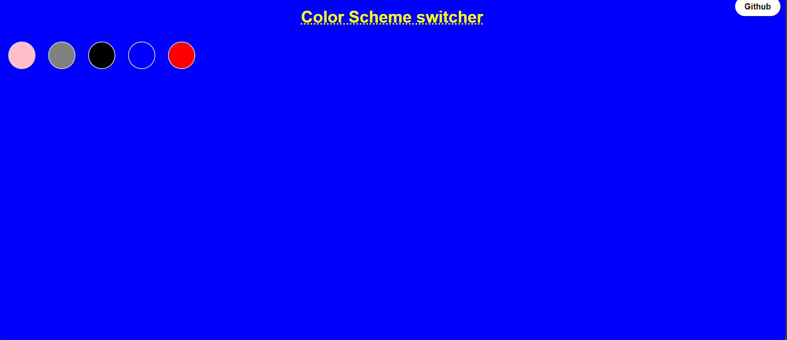
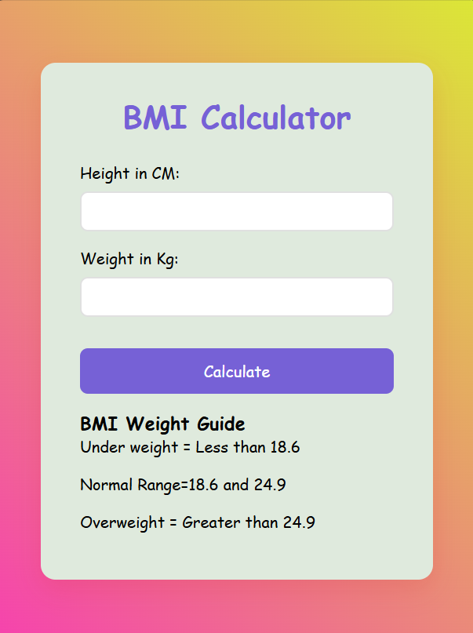

# Mini-projects  
# 🎨 Project-1: Color Scheme Switcher

This is a simple and interactive color theme switcher web application made using **HTML**, **CSS**, and **JavaScript**. It allows users to dynamically change the background color of the page with just a click.

---

## 📸 Screenshot

---

## ✨ Features

- 🎨 Multiple color options (Peach, Grey, Black, Transparent, Red)
- 💡 One-click background switching
- 🟢 Live preview of selected color
- 🌐 GitHub redirect button on top right

---

## 🚀 How It Works

- When a button is clicked, JavaScript changes the background color of the page to the respective value.
- The GitHub button links to the project repository (or profile).

---

## 🛠️ Tech Stack

- **HTML5** – Structure of the webpage  
- **CSS3** – Styles for buttons and layout  
- **JavaScript** – Logic to handle color switching

## Project-2: 🧮 BMI Calculator

A simple and clean **BMI (Body Mass Index) Calculator** built using HTML, CSS, and JavaScript. This app calculates your BMI based on your height and weight and shows the **health category** in a visually styled result box.

---

## 📸 Screenshot

 

---

## ✨ Features

- ✅ Real-time BMI calculation
- 🎨 Gradient background and smooth animations
- 🧼 Reset button to clear inputs and result
- 📱 Fully responsive design for mobile & desktop
- 📊 Categorizes BMI as Underweight, Normal, or Overweight

---

## 🛠️ Built With

- **HTML5** – structure  
- **CSS3** – styling  
- **JavaScript (Vanilla)** – logic and interactivity

---

## 🔢 BMI Formula

**BMI = Weight (kg) / (Height (m))²**

> Example: If your weight is 70kg and height is 170cm,  
> BMI = 70 / (1.7 × 1.7) ≈ 24.22

---

## 📊 BMI Categories

| Category       | BMI Range         |
|----------------|-------------------|
| Underweight    | Less than 18.6    |
| Normal         | 18.6 - 24.9       |
| Overweight     | Greater than 24.9 |

