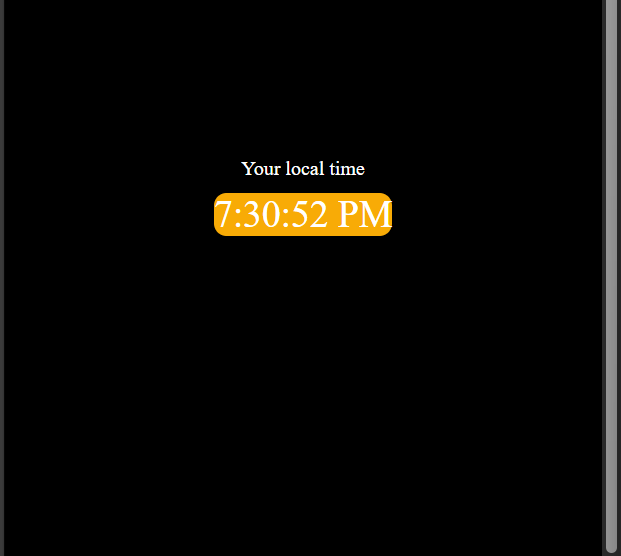
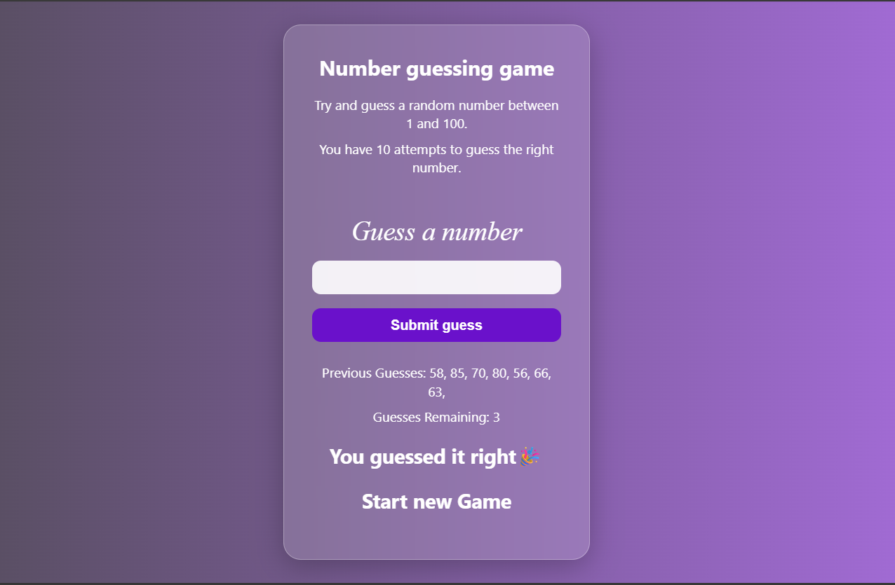

# Mini-projects  
# 🎨 Project-1: Color Scheme Switcher

This is a simple and interactive color theme switcher web application made using **HTML**, **CSS**, and **JavaScript**. It allows users to dynamically change the background color of the page with just a click.

---

## 📸 Screenshot

---

## ✨ Features

- 🎨 Multiple color options (Peach, Grey, Black, Transparent, Red)
- 💡 One-click background switching
- 🟢 Live preview of selected color
- 🌐 GitHub redirect button on top right

---

## 🚀 How It Works

- When a button is clicked, JavaScript changes the background color of the page to the respective value.
- The GitHub button links to the project repository (or profile).

---

## 🛠️ Tech Stack

- **HTML5** – Structure of the webpage  
- **CSS3** – Styles for buttons and layout  
- **JavaScript** – Logic to handle color switching

## Project-2: 🧮 BMI Calculator

A simple and clean **BMI (Body Mass Index) Calculator** built using HTML, CSS, and JavaScript. This app calculates your BMI based on your height and weight and shows the **health category** in a visually styled result box.

---

## 📸 Screenshot

 

---

## ✨ Features

- ✅ Real-time BMI calculation
- 🎨 Gradient background and smooth animations
- 🧼 Reset button to clear inputs and result
- 📱 Fully responsive design for mobile & desktop
- 📊 Categorizes BMI as Underweight, Normal, or Overweight

---

## 🛠️ Built With

- **HTML5** – structure  
- **CSS3** – styling  
- **JavaScript (Vanilla)** – logic and interactivity

---

## 🔢 BMI Formula

**BMI = Weight (kg) / (Height (m))²**

> Example: If your weight is 70kg and height is 170cm,  
> BMI = 70 / (1.7 × 1.7) ≈ 24.22

---

## 📊 BMI Categories

| Category       | BMI Range         |
|----------------|-------------------|
| Underweight    | Less than 18.6    |
| Normal         | 18.6 - 24.9       |
| Overweight     | Greater than 24.9 |
## 🕒 Project-3: Digital Clock

A minimalist and responsive **Digital Clock** built using **HTML**, **CSS**, and **JavaScript**. It displays your current local time in 12-hour format and updates every second. The design features a clean, modern interface with a glowing time display.

---

## 📸 Screenshot

---

## ✨ Features

- 🕰️ Real-time local clock with live seconds
- 🌗 AM/PM 12-hour format display
- 🎨 Glowing time bubble styled with CSS
- ⚡ Lightweight and super fast
- 📱 Fully responsive for all devices

---

## 🚀 How It Works

- Uses JavaScript's `Date()` object to fetch the current time.
- Converts time into 12-hour format with AM/PM.
- Updates the DOM every second using `setInterval()`.

---

## 🛠️ Tech Stack

- **HTML5** – Markup structure  
- **CSS3** – Styling and glowing effect  
- **JavaScript** – Clock logic and real-time update

---

## 📂 File Structure

# 🎮 Project-4: Guess the Number Game

A fun and interactive **"Guess the Number"** game built using **HTML**, **CSS**, and **JavaScript**. The user has 10 chances to guess a random number between 1 and 100. It features a clean **glassmorphism UI** and gives feedback on each guess!

---

## 📸 Screenshot

---

## ✨ Features

- 🔢 Random number generation between 1 and 100
- 💬 Instant feedback: Too High / Too Low / Correct
- ✅ Tracks previous guesses and remaining attempts
- 🎨 Beautiful **glassmorphism** UI with responsive design
- 🔄 Automatic prompt to restart game after win or loss

---

## 🚀 How It Works

1. User enters a number between 1 and 100.
2. App checks if it's correct, too high, or too low.
3. Game ends if the number is guessed or after 10 attempts.
4. Option to **restart** the game automatically appears.

---

## 🛠️ Tech Stack

- **HTML5** – Markup structure  
- **CSS3** – Styles using modern glass UI  
- **JavaScript (Vanilla)** – Game logic and interactivity

---

